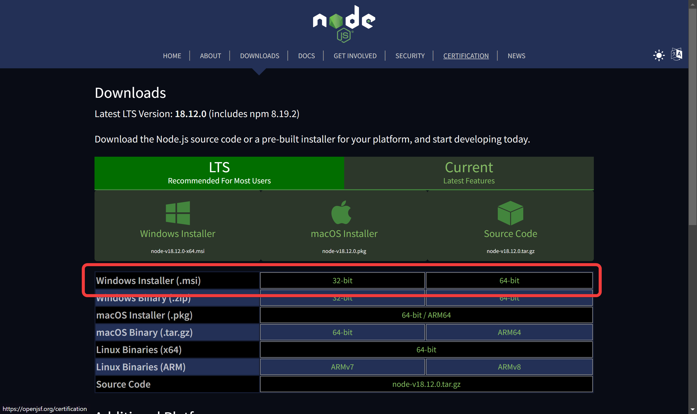
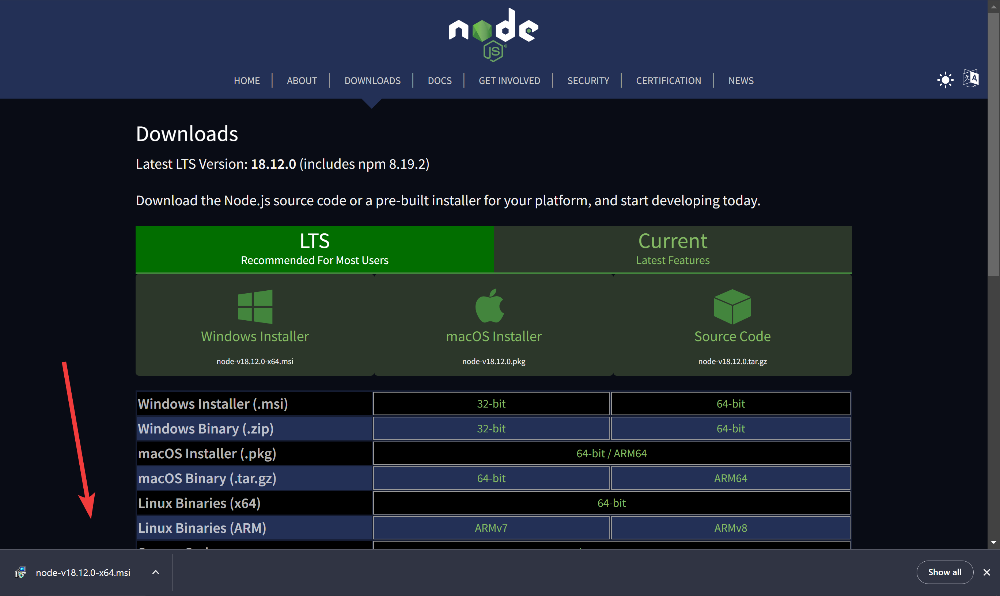
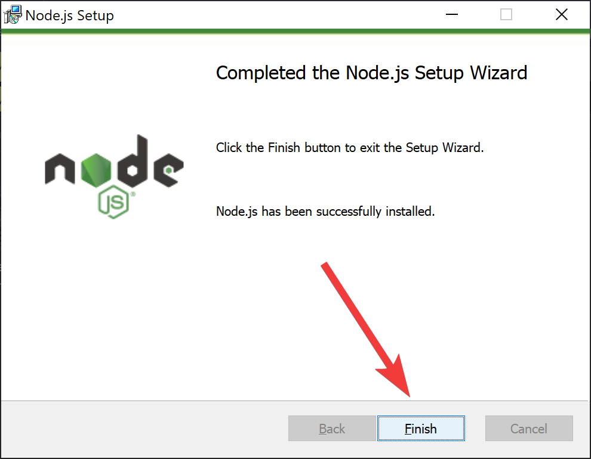
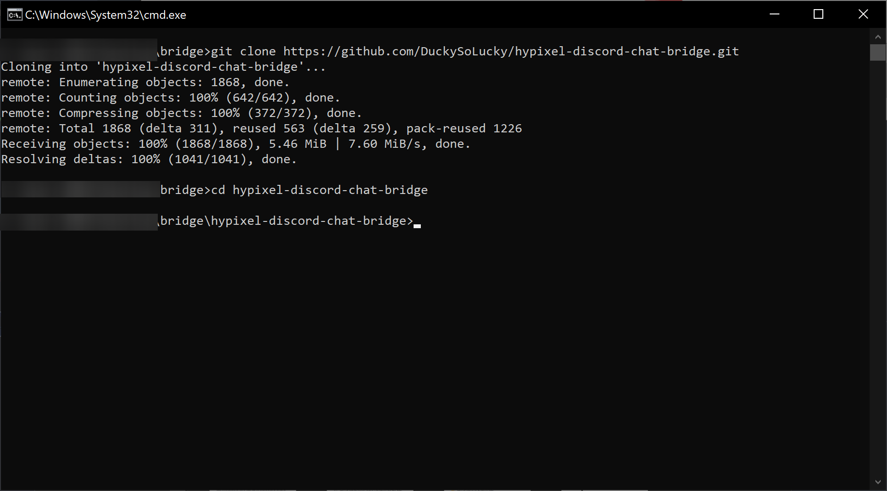

# Guide to installing NodeJS with images

## Table of Content

### Windows

- [Downloading NodeJS](#downloading-nodejs-windows)
- [Running NodeJS Command](#running-nodejs-windows)

### MacOS

- [Downloading NodeJS](#downloading-nodejs-macos)
- [Running NodeJS Command](#running-nodejs-command-macos)

# Windows

## Downloading NodeJS Windows

Goto the [NodeJS download](https://nodejs.org/en/download/) and find windows

Then select the correct option out of 32 and 64bit installer

Once the installer has downloaded click on it

Once the installer has loaded keep selecting next and leave everything defualt
**When the popup comes asking for admin permission CLICK YES**

Once installer is complete click finish

## Running NodeJS Windows

With CMD still open type `cd hypixel-discord-chat-bridge` and click enter

Then type `npm i`

Once its finished you can start the bot using `node index.js`

# MacOS COMING SOON

## Downloading NodeJS MacOS

## Running NodeJS Command MacOS
