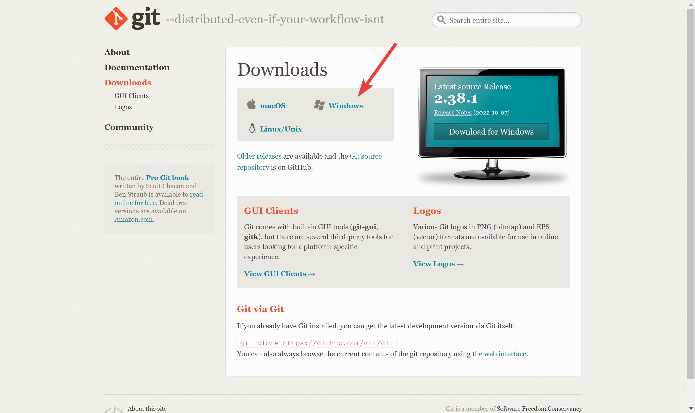
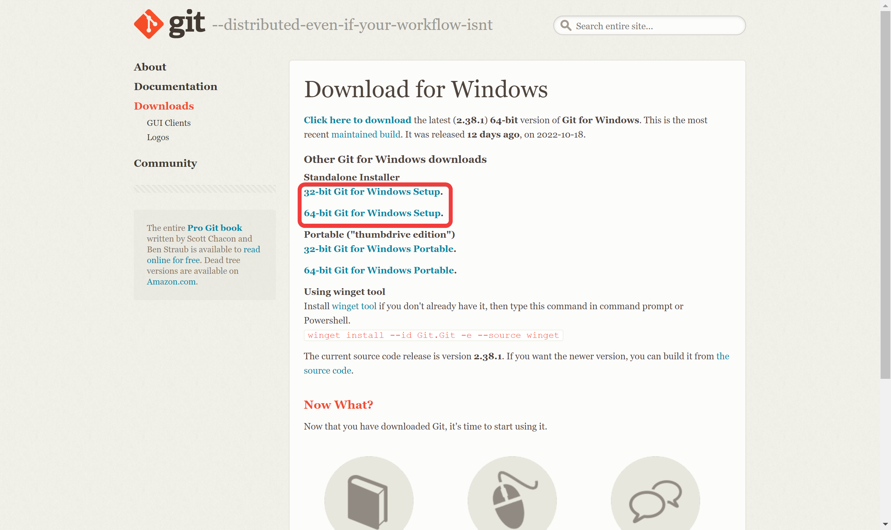
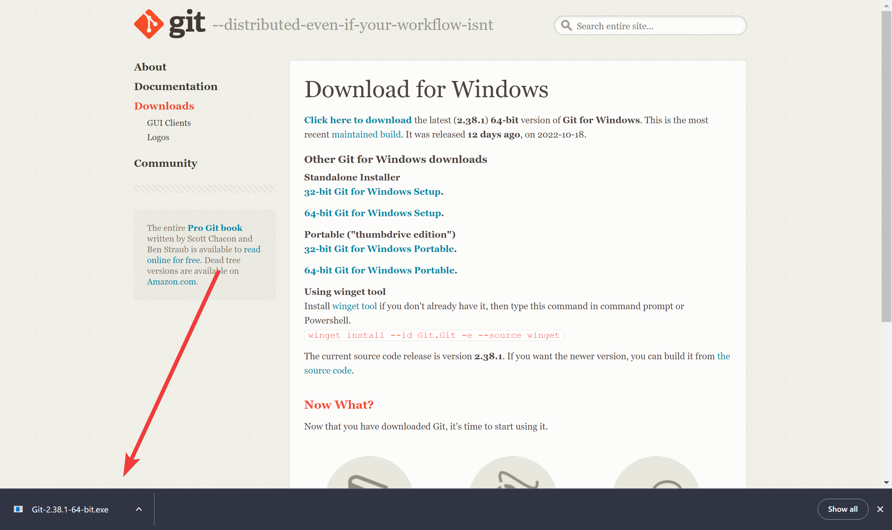
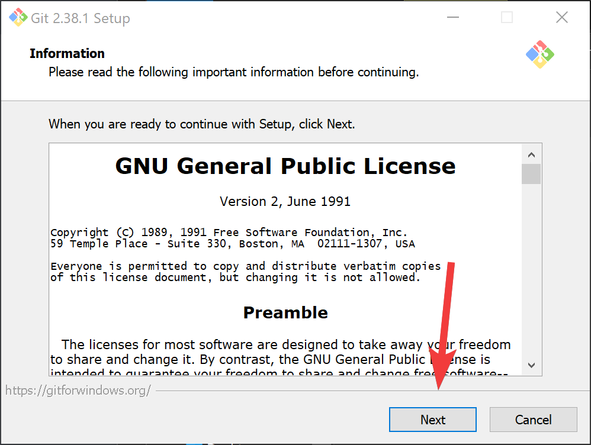
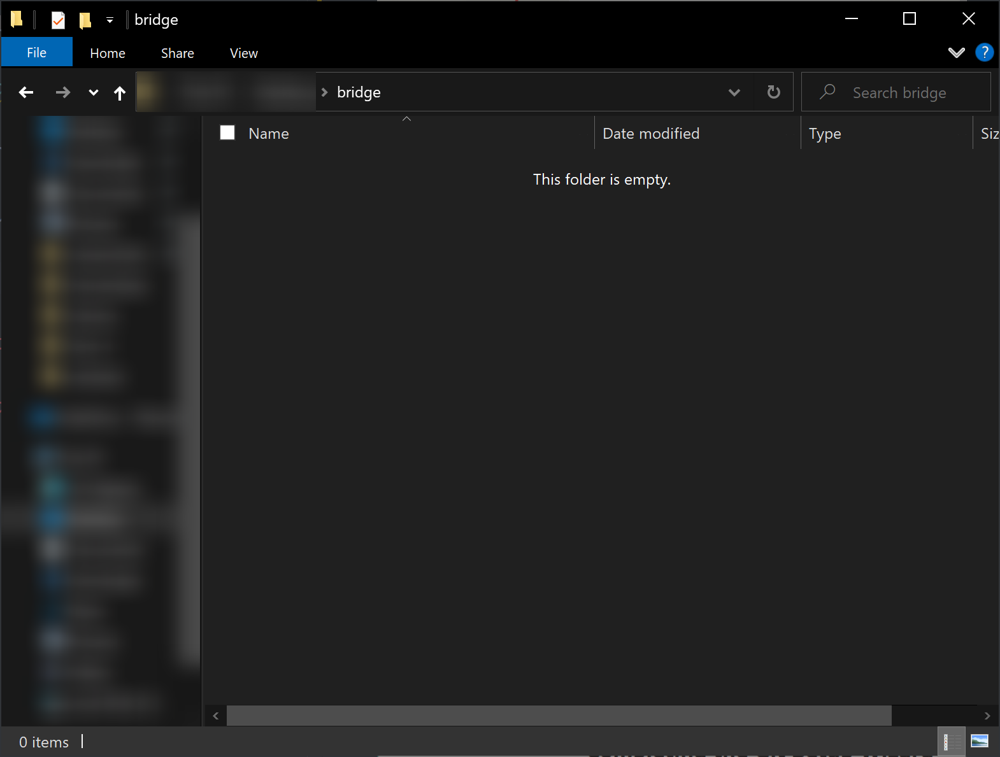
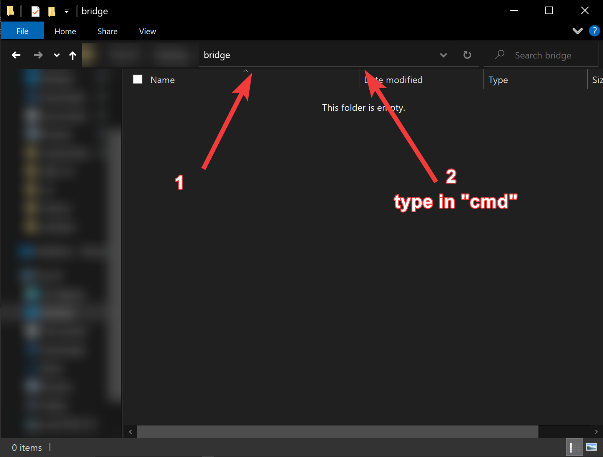
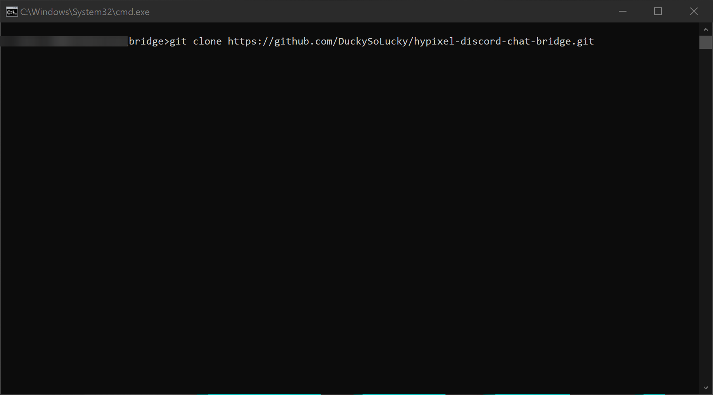
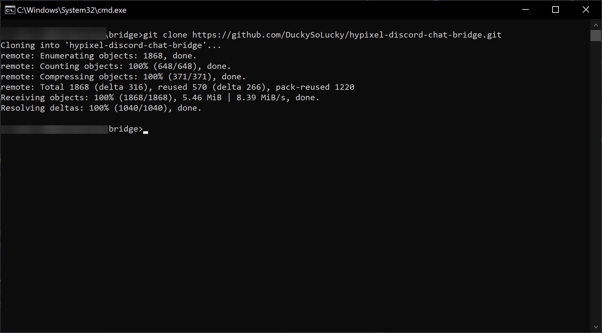

# Guide to installing Git with images

## Table of Content

### Windows

- [Downloading Git](#downloading-git-windows)
- [Running Git Command](#running-git-command-windows)

### MacOS

- [Downloading Git](#downloading-git-macos)
- [Running Git Command](#running-git-command-macos)

# Windows

## Downloading Git Windows

Goto the [git download](https://git-scm.com/downloads) select Windows

Then select the correct option out of 32 and 64bit installer

Once the installer has downloaded click on it
**When the popup comes asking for admin permission CLICK YES**

Once the installer has loaded keep selecting next and leave everything defualt

Once installer is complete. Deslect "View Release Notes" and click finish

## Running Git Command Windows

Make a foldor where you want the bridge

Then in the address bar type "CMD" and press enter

When the box comes up type `git clone https://github.com/DuckySoLucky/hypixel-discord-chat-bridge.git` into it and press enter

Once it has finished leave it open you will need it later

# MacOS COMING SOON

## Downloading Git MacOS

## Running Git Command MacOS
